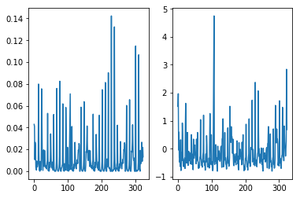
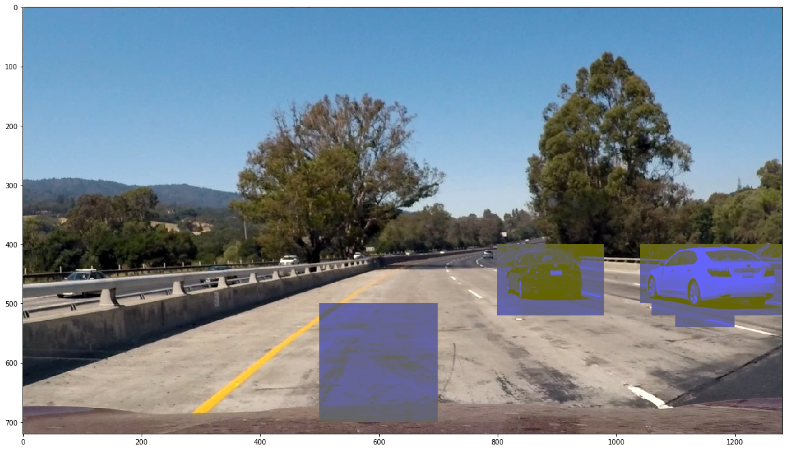
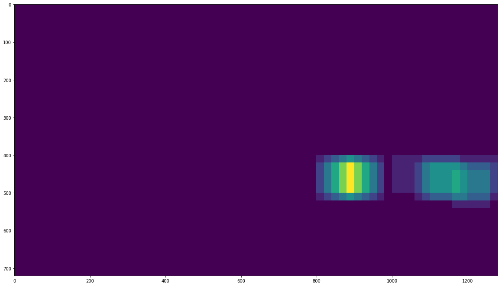

# Vehicle Detection Project - Peter Tempfli

Please see the final project output here:

[](https://www.youtube.com/watch?v=-URKrWwJdz0)


Please see the [project jupyter notebook](./project.ipynb) here.


## Histogram of Oriented Gradients (HOG)


### Hog feature extraction

For extracting the HOG features I'm using the default settings of skimage HOG algorithm on the L channel of the HLS color space.


```
def features_from_img(image):
    img = cv2.cvtColor(image, cv2.COLOR_BGR2HLS)[:,:,1]
    vec = hog(img, visualise=False)
    return vec
```


### Classifier training

This peace of code shows how the training sets were built. I'm using the StandardScaler algorithm to normalize my training data. Once the data and the label sets are built, I'm generating a randomly sampled training and test set.

Here's a plot of one data point before and after normalization:



```
car_features = [features_from_img(img) for img in car_img]
non_car_features = [features_from_img(img) for img in non_car_img]
features = car_features + non_car_features

scaler = StandardScaler()
scaler.fit(features)

features = scaler.transform(features)
labels = [1 for i in range(len(car_features))] + [0 for i in range(len(non_car_features))]

X_train, X_test, y_train, y_test =  train_test_split(features, labels, test_size=0.15, random_state=999)
```

I'm using the SVC classifier -- it takes appr. 20 seconds to train on the 15.000 points datataset.
It is interesting to see that if the dataset is not normalized, it takes more than 3 minutes -- it's probably means that the non-normalized data is very sparse.

```
from sklearn.svm import SVC
clf = SVC()
clf.fit(X_train[:n],y_train[:n])
print("Time:", time.time() - t)
````

The achieved score is 98% on the training set and 97% on the test set.

### Sliding window search

My pipeline is working the following way.

1. Generating window coordinates
2. Crop chunk from the image
3. Resize the chunks (32 x 32)
4. Make predictions of all the chunks
5. Saving positives on a heat-map for the given frame
6. Getting a moving sum of the heat-map for the last N frames
7. Applying a threshold
8. Finding 'islands' (linked areas of non-zeros) on the summarized and thresholded heat-map
9. Drawing boxes around those islands

#### Generating window coordinates

For this I'm using a trivial algorithm. It is called 3 times in order to get different window sizes.

```
    chunk_coords = []
    chunk_coords += get_boxes(box_size=100, step=0.2, top_crop = 400, left_crop=500)
    chunk_coords += get_boxes(box_size=150, step=0.2, top_crop = 450, left_crop=500)
    chunk_coords += get_boxes(box_size=200, step=0.3, top_crop=500, left_crop=500)
```

```
def get_boxes(shape=(720, 1280), box_size=100, step=0.5 , top_crop=400, bottom_crop=200, left_crop=300, right_crop=0):
    box_list = []
    y = top_crop
    while y < shape[0] - bottom_crop:
        x = left_crop
        while x < shape[1] - right_crop:
            box_list.append((y, x, y + box_size, x + box_size))
            x += int(box_size * step)
        y += int(box_size * step)
    return box_list
```

#### Predictions

For predictions I'm using the previously trained classifier. It is important that the data from the chunks should be normalized.

```
preds = clf.predict(scaler.transform([features_from_img(ch) for ch in chunks])) 

```


#### The heat map

If there is a match, I'm adding 1 to the heat map:

```
    matching_indices = [i for i,x in enumerate(preds) if x == 1]

    heat_frame = np.zeros((img.shape[0], img.shape[1]))
        
    for i in matching_indices:
        y1, x1, y2, x2 = chunk_coords[i]
        heat_frame[y1:y2, x1:x2] += 1
````




#### Data aggregation from the last N-frames
I'm using data from the last 15 frames.

```
    # the aggregated heat frame data
    hf = np.sum(heat_map[-15:], axis=0)
    hf[hf < threshold] = 0
```

#### Boxes around non-zero areas
Once the aggregated heat-map is created, I'm using the following algorithm to draw boxes around 'islands':


```
from scipy.ndimage import label
def get_squares(d):
    arr = np.zeros(d.shape)
    arr[d!=0] = 1
        
    labeled, features = label(arr)
    
    boxes = []
    for i in range(1, features+1):
        y_coords, x_coords = np.where(labeled == i)
        boxes.append((np.min(y_coords), np.min(x_coords), np.max(y_coords), np.max(x_coords)))
        
    return boxes

```

### False positives, false negatives, problems, ideas to improve

#### False positives

As the classifier generates a lot of false positives, I'm 2 tactics to reduce them:

1. Using overlapping search windows generated and adding up the results; after this using a threshold. This approach helps to filter some occasiaonal 'wiggling' negatives.

2. Summarizing the 'heat-map' for the last N-frames and using a threshold. This also helps to stabilize the true positives, as they are more likely to appear on almost every frame.


#### False negatives

At some light conditions the pipeline can't identify vehicles. Maybe using more data would help, i.e. adding color information to the datapoints.

#### Speed

I'm trying to reduce the space where I'm looking for vehicles simply by reducing the searching area. Some other ways could also speed up the pipeline:

1. Using HOG transform only once per frame
2. Reducing the frame size
3. Reducing the search area more extremely, for example look for the whole road only every 5 frames, and make a full search only where cars appeared in the previous frames.


